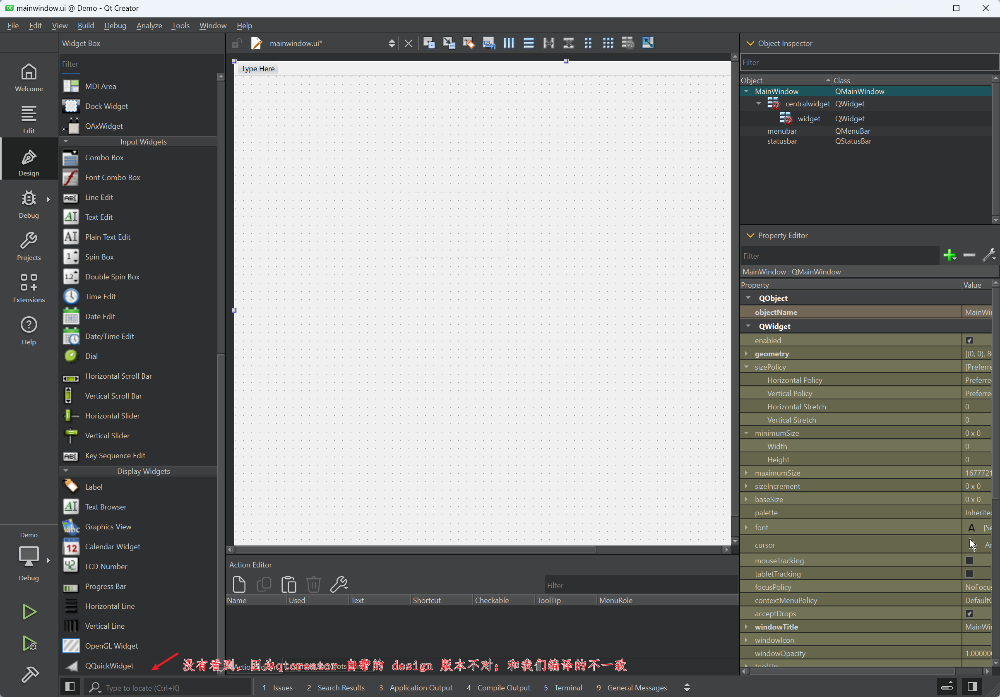
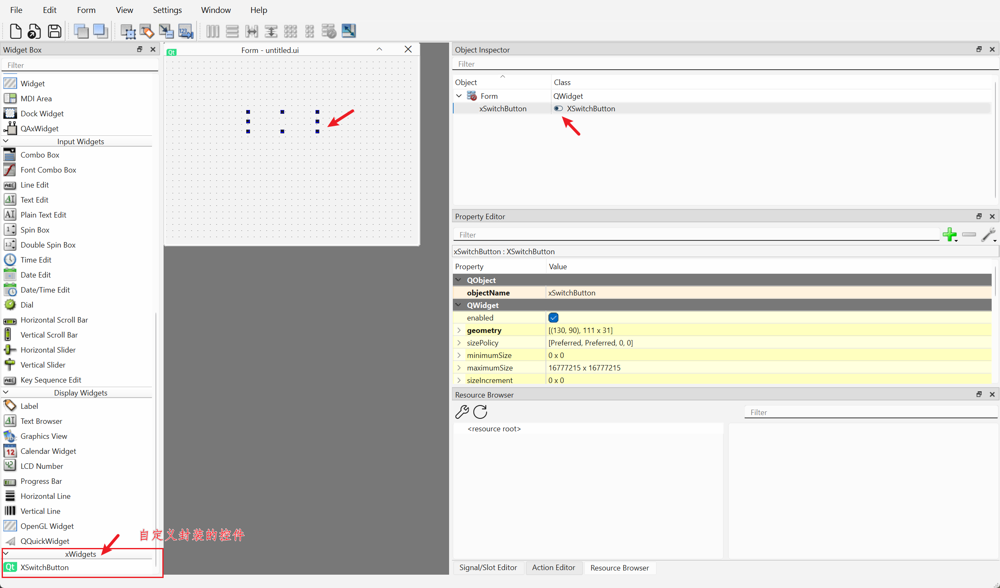

- xswitchbuttonplugin.dll 拷贝到 C:\Qt\6.8.0\msvc2022_64\plugins\designer

- xswitchbuttonplugin.lib 拷贝到 C:\Qt\6.8.0\msvc2022_64\lib

- xswitchbutton.h 头文件拷贝到 C:\Qt\6.8.0\msvc2022_64\include\xwidgets，此路径在 includeFile 中的 xwidgets

  - ```cpp
    // xwidgets 的来源于 xswitchbuttonplugin.cpp 此函数的 "xwidgets/
    QString XSwitchButtonPlugin::includeFile() const
    {
        return QLatin1String("xwidgets/xswitchbutton.h");
    }
    ```

    

无法直接对应 Qt Creator 无法直接看到该自定义封装的控件




但是通过 `"C:\Qt\6.8.0\msvc2022_64\bin\designer.exe"` 打开，是可以看到的




Ref：

- [QT自定义控件及使用方法](https://huangwang.github.io/2023/11/30/QT%E8%87%AA%E5%AE%9A%E4%B9%89%E6%8E%A7%E4%BB%B6%E5%8F%8A%E4%BD%BF%E7%94%A8%E6%96%B9%E6%B3%95/)

- [Qt编写自定义控件插件路过的坑及注意事项](https://www.cnblogs.com/feiyangqingyun/p/6182320.html)

- [Qt Creator无法显示自定义控件](https://blog.csdn.net/lwydezh/article/details/109112173)